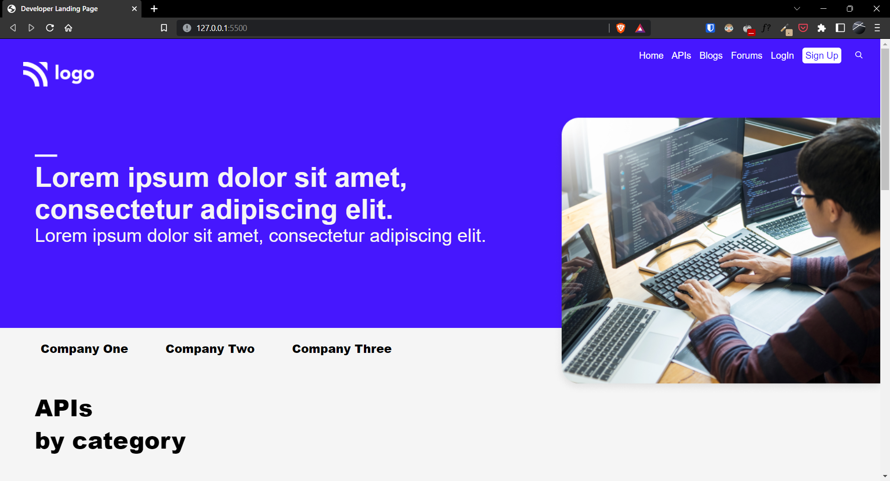
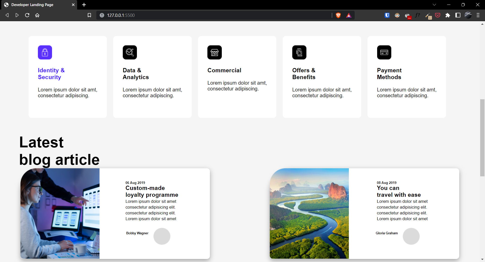

# Project-09 | Developer Landing Page

Hi there,
I'm Wasit Ali and this is my 9th project on HTML and CSS.

## 🖥 Preview

🚀 [Live Preview](https://live-class-project-09-three.vercel.app/)

## 🛠️ What I have learned in this project?

- Float property usecase.
- Learnt about cards and added shadow property to cards on hover.
- Handling various image files and resize them according to the viewport provided.

## ⏲ Time to finish the project

- 2 days
